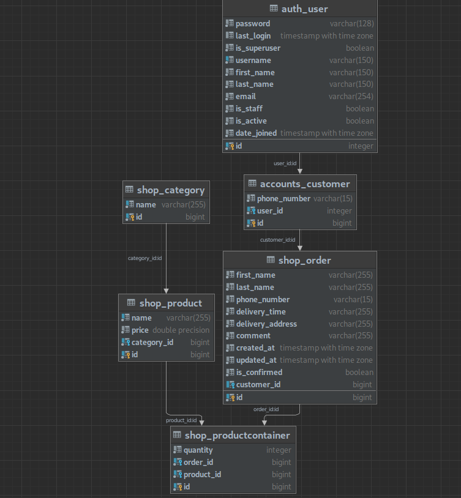
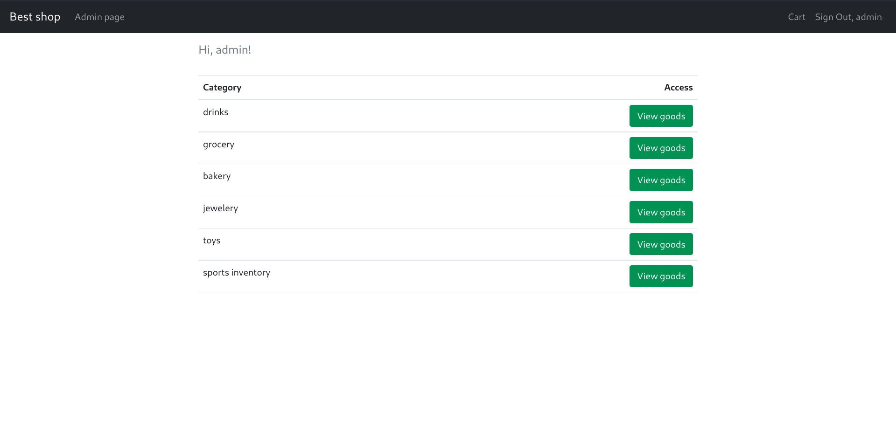
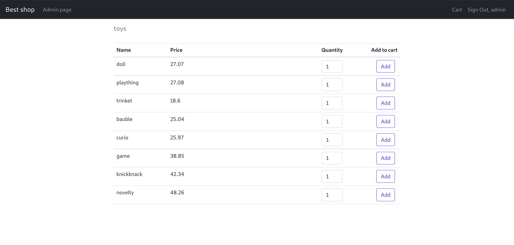
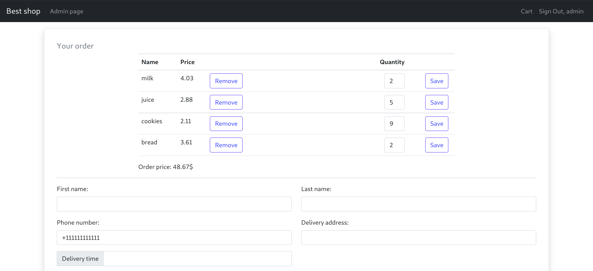
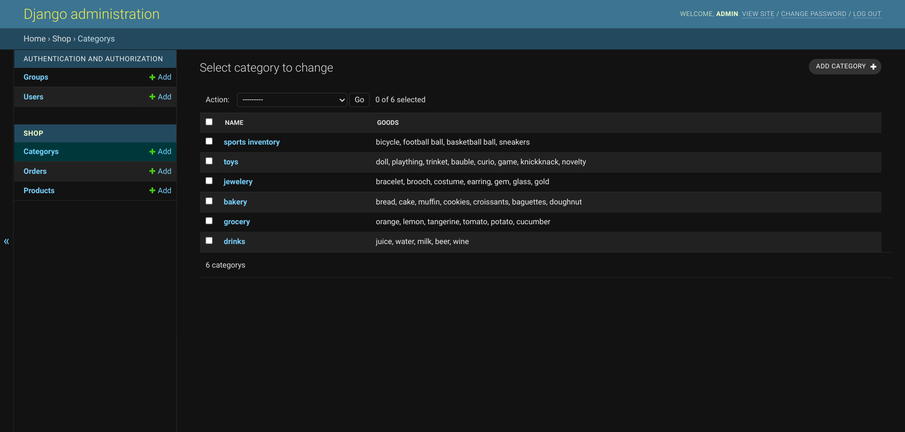
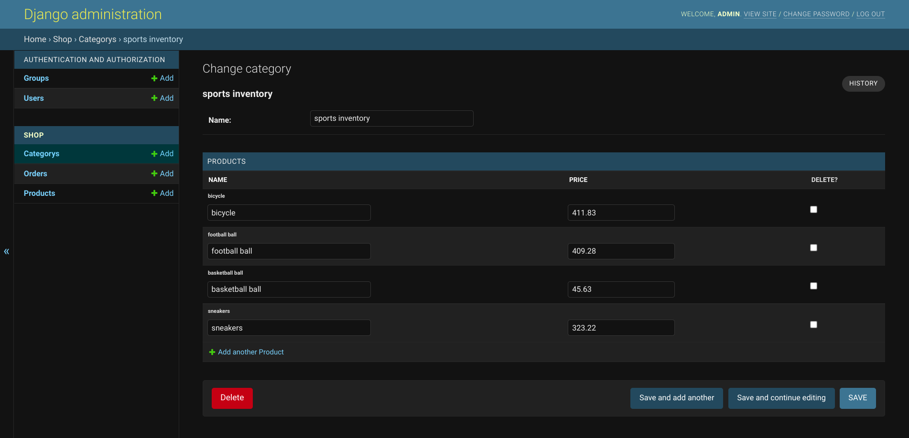

# Shop
Проект представляет собой сайт интернет-магазина с возможностью оформления заказов и сохранением результатов в базе данных. 
Проект реализован при помощи фреймворка Django.

## Использованные технологии
В качестве основы был использован Python 3.8 и Django 3.2. В качестве базы данных была выбрана PostgreSQL. 
В качестве вспомогательной технологии вёрстки использовался Bootstrap. Контроль версий проекта осуществлялся с помощью Git.

## Установка и настройка проекта
В итоговую документацию это можно не вставлять, но вообще, по моему опыту, 
почти в любой документации к ПО есть инструкция по установке
### Подготовка
Перед тем, как приступить к настройке проекта, необходимо установить 
python 3 и postgreSQL. В postgreSQL также необходимо создать базу данных под названием `shop`.

### Настройка проекта
1. Клонирование репозитория с кодом
```
git clone https://github.com/akimich11/internet-shop.git
```
2. Создание виртуального окружения python (внутри папки с репозиторием)
```
python -m venv venv
```
3. Активация виртуального окружения (Linux)
```
source venv/bin/activate
```
4. Установка необходимых зависимостей проекта
```
pip install -r requirements.txt
```
5. Применение миграций базы данных (создание таблиц)
```
python manage.py migrate
```
6. Заполнение базы тестовыми данными
```
python manage.py create_default_data
```
В результате выполнения команды будет создан суперпользователь `admin` с паролем `pass1234`, 
а также товары для магазина.

7. Запуск проекта у себя на компьютере
```
python manage.py runserver localhost:8000
```
После проделанных процедур в браузере по адресу `https://localhost:8000` должен появиться доступ к веб-сайту.


## Функционал
* Выбор товаров и добавление их в корзину
* Выбор количества товаров
* Расчёт стоимости заказа с учётом количества товаров
* Панель администратора с возможностью редактирования данных о товарах, категориях, заказах и пользователях
* Вход и регистрация пользователей


## Описание решения

### Архитектура базы данных
Помимо стандартных таблиц Django, было дополнительно создано ещё 5. 
Таблицы и связи между ними отображены на скриншоте ниже.




### Структура проекта
Проект состоит из двух приложений: `accounts` и `shop`. Каждое из них представляет собой папку, в которой 
находятся:
* модели для базы данных (`models.py`)
* логика для работы с запросами пользователя (`views.py`) 
* формы (`forms.py`)
* список используемых url-адресов (`urls.py`)
* папка `templates` с html-шаблонами страниц
* некоторые другие вспомогательные файлы

html-шаблоны были написаны с использованием Django Template Language, позволяющего динамически изменять шаблоны в 
зависимости от данных. Вёрстка и стили были реализованы с помощью Bootstrap. Для избежания дублирования кода в некоторых
местах было использовано наследование шаблонов.

В папке `src` находится файл с основными настройками проекта (`settings.py`), и другие необходимые для запуска
веб-сайта файлы.

За запуск проекта отвечает скрипт `manage.py`, зависимости проекта хранятся в файле `requirements.txt`.

### Результат
На главной странице магазина отображаются все категории товаров


С помощью кнопки `View goods` можно открыть любую категорию. Здесь же можно добавить товар в корзину, 
указав его необходимое количество


После выбора необходимых товаров можно перейти на страницу с оформлением заказа, нажав на кнопку `Cart`


После заполнения и отправки формы будет сформирован заказ в базе. Его может увидеть администратор на странице `Admin page`.
Панель администратора была реализована с помощью встроенных средств Django


На панели администратора можно редактировать информацию о товарах и категориях, а также просматривать сформированные заказы


